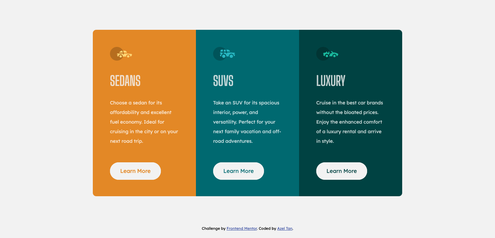

# Frontend Mentor - 3-column preview card component solution

This is a solution to the [3-column preview card component challenge on Frontend Mentor](https://www.frontendmentor.io/challenges/3column-preview-card-component-pH92eAR2-). Frontend Mentor challenges help you improve your coding skills by building realistic projects. 

## Table of contents

- [Overview](#overview)
  - [The challenge](#the-challenge)
  - [Screenshot](#screenshot)
  - [Links](#links)
- [My process](#my-process)
  - [Built with](#built-with)
  - [What I learned](#what-i-learned)
  - [Continued development](#continued-development)
  - [Useful resources](#useful-resources)
- [Author](#author)

## Overview

### The challenge

Users should be able to:

- View the optimal layout depending on their device's screen size
- See hover states for interactive elements

### Screenshot

Desktop view:

### Links

- Solution URL: [https://github.com/azelalynetan/azel-frontend-mentor--3-column-preview-card](https://github.com/azelalynetan/azel-frontend-mentor--3-column-preview-card)
- Live Site URL: [https://azelalynetan.github.io/azel-frontend-mentor--3-column-preview-card/](https://azelalynetan.github.io/azel-frontend-mentor--3-column-preview-card)

## My process

### Built with

- Flexbox
- Mobile-first workflow

### What I learned

This is my first front-end mentor challenge. 
It's my first time to use flexbox without relying on frameworks. I tried the mobile first approach for the responsive. 
Overall, I've enjoyed working on this and more challenge to solve soon!

### Continued development

Try CSS grid instead of flexbox.
Use HTML5 Semantic Elements - practice code with accessibility.

### My next goals ..

I want to practice and improve more on using flexbox and later, CSS grid. 
I also want improve also my personal judgement on sizes, spacings, margins, etc. 

## Author

- Website - [azelalynetan](https://azelalynetan.github.io/)
- Frontend Mentor - [@azelalynetan](https://www.frontendmentor.io/profile/azelalynetan)
- Twitter - [@azeltan](https://www.twitter.com/azeltan)